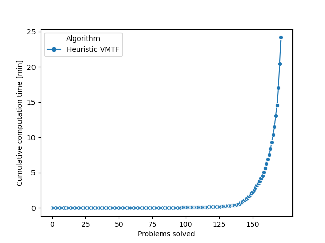

# SAT_Solving_Problem_3

## Disclosure

We implemented all mandatory and optional (bonus) tasks. Our algorithm successfully solves most problems
within the time frame of 1min, and often even in matter of seconds, which we are very proud of.
However, we want to explicitly mention the fact that the following problem types listed below could
*not* be solved efficiently:

SAT: ii16, ii32, ii8, par
UNSAT: hole8/9

A main issues was that problems with over 20.000 clauses slowed down the CDCL algorithm logic due to implementation 
limitations. For that reason, in order to generate the plots some of the above mentioned problem types were moved
to a different folder (named "malfunction").

Still, we optimized our algorithm to solve the very vast (!) majority of the provided SAT problems quick 
(in matter of milliseconds). We have noticed that different hyperparameters & heuristics performed differently well on different problems.

Finally, we added an option to generate UNSAT proofs (for verification purposes). 

## Running the program:

### Files

> SAT_Solver.exe -file "../inputs/test_all/unit.cnf"

### Directories

Single Directory:

> SAT_Solver.exe -dir "../inputs/test_all"

Up to two Directories:

> SAT_Solver.exe -dir "../inputs/test/sat" "../inputs/test/unsat"

### Proof

To generate **.drup** files for proof logging and verifying **with drat-trim** just add the *"proof"* tag:

> SAT_Solver.exe -dir "../inputs/test_all" proof

## Generating the plots:

After you have run a Directory of Problem you can generate a plot for the steps and times.

### Steps Plot:

> python plot-steps.py

### Times Plot:

> python plot-times.py

## Results:
The total run time was app. **27 min** for all ** 172 files** (in "inputs/test_all").

We see that most (>90%) SAT formulas were even solved in matter of seconds.